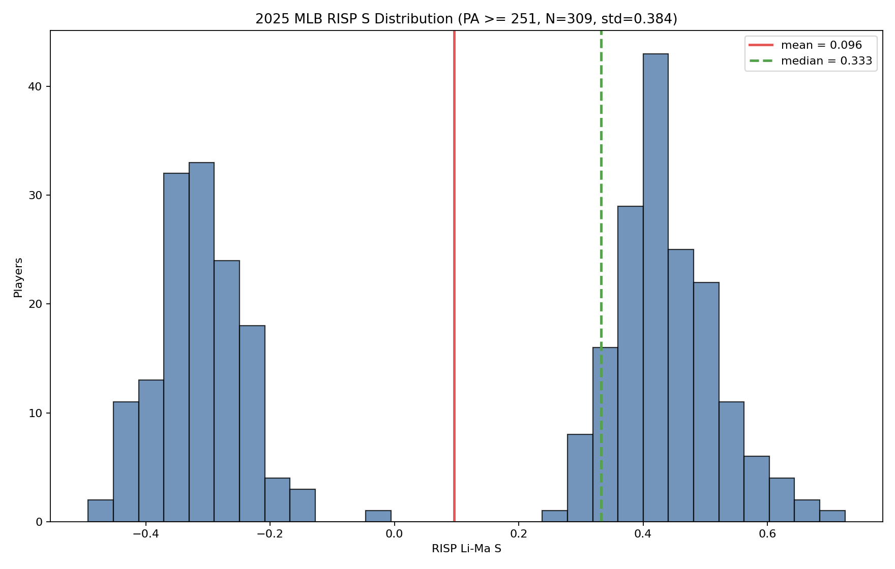

# A Method for Identifying Clutch Hitters

Classic approaches to identifying clutch hitters include Cramer's expected PWA framework and Ruane's direct RISP vs. non-RISP comparison. Ruane's RISP definition could later be replaced by LIPS, or supplemented with a LIPS-based analysis. This project explores whether ideas from astrophysical ON/OFF analysis can be used to statistically improve Ruane-style within-player comparisons.

In astrophysical counting experiments, the number of events observed in an ON region, where a source is expected to be present, is compared against the number of events observed in an OFF region, which serves as a background or control region. When the two regions differ in size, observation time, or effective exposure, an exposure ratio is used to account for that imbalance. Li-Ma significance is one representative method built for this kind of problem. Translating the broader ON/OFF philosophy to baseball suggests a way to compare each player's own clutch and non-clutch performance directly, rather than relying primarily on how that player performed relative to the entire league.

However, the current version exposes an important statistical issue. The original Li-Ma significance is derived under a Poisson counting-process model. In baseball, by contrast, measuring the number of successful outcomes out of a fixed number of plate appearances or at-bats is more naturally modeled with a binomial distribution. Because ordinary hitting success probabilities are not clearly in a rare-event regime, simply approximating the problem with a Poisson distribution and applying the existing Li-Ma formula is difficult to justify statistically. For that reason, the currently implemented Li-Ma significance is not presented as the final analysis method. The next step is to investigate whether the ON/OFF likelihood-ratio idea behind Li-Ma can be translated or adapted in a statistically valid way for a binomial setting. Once that methodology is established, it can be applied to the actual search for clutch hitters.

## Repository Layout

```text
.
├── Data/
│   ├── Retrosheet/2025/                 # Compact 2025 team PA extracts
│   ├── *_2025_RISP_sample_counts.csv    # Player-level RISP/non-RISP summaries
│   └── mlb_2025_RISP_S_histogram_PA251.png
├── Script/
│   ├── build_retrosheet_pa_compact.py   # Build compact PA data from Retrosheet event files
│   ├── build_league_RISP_sample_counts.py
│   ├── lima_histogram_RISP_sample.py    # Core RISP labeling and Li-Ma S helpers
│   └── plot_RISP_histogram.py
├── cle_2026_07_plate_appearances_compact.csv
└── cle_2026_07_statcast_pitches_raw.csv
```

## Method

For each hitter:

- `n`: plate appearances with a runner on second and/or third
- `b`: plate appearances without RISP
- `n_rate`: success rate in RISP plate appearances
- `b_rate`: success rate in non-RISP plate appearances
- `S`: signed Li-Ma style statistic comparing `n_rate` with `b_rate`

Success events currently include singles, doubles, triples, and home runs. Walks, hit by pitch, catcher interference, and sacrifice bunts are excluded from the success-rate denominator.

## Reproduce

Create an environment and install dependencies:

```bash
python3 -m venv .venv
source .venv/bin/activate
pip install -r requirements.txt
```

Build the 2025 league player summary:

```bash
python Script/build_league_RISP_sample_counts.py
```

Generate the histogram used in `Data/mlb_2025_RISP_S_histogram_PA251.png`:

```bash
python Script/plot_RISP_histogram.py --output Data/mlb_2025_RISP_S_histogram_PA251.png
```

## Current Snapshot

Using 2025 compact PA extracts and a minimum of 251 total PA, the distribution is centered close to zero, which is consistent with the idea that much of observed RISP variation is noisy at one-season sample sizes.



## Next Steps

- Add year-over-year stability checks for player RISP `S`.
- Compare start-of-PA runner state against final-pitch runner state.
- Add shrinkage estimates for small-sample RISP performance.
- Extend the Cleveland 2026 sample into a team-specific dashboard view.

## Data Notes

The compact 2025 plate-appearance extracts are derived from Retrosheet-style play data. Retrosheet terms and attribution should be followed for any public use of their source data.
