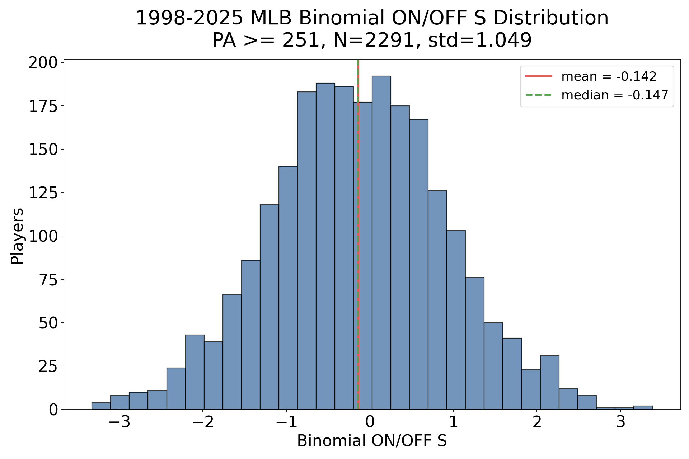

# A Method for Identifying Clutch Hitters

Classic approaches to identifying clutch hitters include Cramer's expected PWA framework and Ruane's direct RISP vs. non-RISP comparison. Ruane's RISP definition could later be replaced by LIPS, or supplemented with a LIPS-based analysis. This project explores whether ideas from astrophysical ON/OFF analysis can be used to statistically improve Ruane-style within-player comparisons.

In astrophysical counting experiments, the number of events observed in an ON region, where a source is expected to be present, is compared against the number of events observed in an OFF region, which serves as a background or control region. When the two regions differ in size, observation time, or effective exposure, an exposure ratio is used to account for that imbalance. Li-Ma significance is one representative method built for this kind of problem. Translating the broader ON/OFF philosophy to baseball suggests a way to compare each player's own clutch and non-clutch performance directly, rather than relying primarily on how that player performed relative to the entire league.

The current implementation replaces the original Poisson Li-Ma formula with a binomial ON/OFF likelihood-ratio statistic. This should be understood as a Li-Ma-style ON/OFF adaptation for two binomial samples, not as the original Li-Ma significance itself. The statistic compares each player's clutch and non-clutch success probabilities while accounting for the number of observed successes and failures in both samples.

## Repository Layout

```text
.
├── Data/
│   ├── Retrosheet/Compact/              # 1998-2025 compact MLB PA extracts
│   ├── Retrosheet/Raw/                  # Local Retrosheet zip downloads, ignored by git
│   ├── mlb_1998_2025_RISP_sample_counts.csv
│   └── mlb_2025_RISP_sample_counts.csv
├── Script/
│   ├── download_retrosheet_csv.py
│   ├── build_retrosheet_pa_compact.py   # Build compact PA data from Retrosheet event files
│   ├── build_retrosheet_pa_compact_range.py
│   ├── build_league_RISP_sample_counts.py
│   ├── lima_histogram_RISP_sample.py    # Core RISP labeling and binomial ON/OFF S helpers
│   └── plot_RISP_histogram.py
├── cle_2026_07_plate_appearances_compact.csv
└── cle_2026_07_statcast_pitches_raw.csv
```

## Method

The working derivation for the binomial ON/OFF likelihood-ratio statistic is saved in [`docs/binomial_on_off_likelihood_derivation.md`](docs/binomial_on_off_likelihood_derivation.md).

For each hitter:

- `n`: plate appearances with a runner on second and/or third
- `b`: plate appearances without RISP
- `n_trials`: RISP successes plus failures, excluding walks, hit by pitch, catcher interference, and sacrifice bunts
- `b_trials`: non-RISP successes plus failures under the same event filter
- `n_rate`: success rate in RISP plate appearances
- `b_rate`: success rate in non-RISP plate appearances
- `S`: signed binomial ON/OFF likelihood-ratio statistic comparing `n_rate` with `b_rate`

Success events currently include singles, doubles, triples, and home runs. Walks, hit by pitch, catcher interference, and sacrifice bunts are excluded from the success-rate denominator.

## Reproduce

Create an environment and install dependencies:

```bash
python3 -m venv .venv
source .venv/bin/activate
pip install -r requirements.txt
```

Download Retrosheet parsed CSV zip files:

```bash
python Script/download_retrosheet_csv.py --start-year 1998 --end-year 2025
```

Build compact plate-appearance files:

```bash
python Script/build_retrosheet_pa_compact_range.py --start-year 1998 --end-year 2025
```

Build the 1998-2025 player summary:

```bash
python Script/build_league_RISP_sample_counts.py \
  --input-glob 'Data/Retrosheet/Compact/mlb_*_plate_appearances_compact.csv' \
  --output Data/mlb_1998_2025_RISP_sample_counts.csv
```

Show the histogram:

```bash
python Script/plot_RISP_histogram.py
```

## Current Snapshot

Using 1998-2025 compact PA extracts and a minimum of 251 total PA, the current binomial ON/OFF statistic is approximately centered near zero with a spread close to one.



## Next Steps

- Validate the binomial ON/OFF statistic against standard two-proportion likelihood-ratio tests and simulation checks.
- Adjust the null model for league-wide situational effects if RISP and non-RISP baselines differ systematically.
- Split the analysis into season-level, career-level, and rolling-window views.
- Add LIPS data.
- Set upper limits for player-specific clutch effects.

## Data Notes

The compact 1998-2025 plate-appearance extracts are derived from Retrosheet parsed play-by-play CSV files. Retrosheet terms and attribution should be followed for any public use of their source data.
